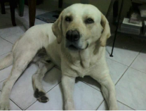

<h1 align="center">Hi 👋, I'm Jose Luis Vallejos</h1>
<h3 align="center">Front-end Developer || HTML || CSS || Bootstrap || SASS || SCSS || JavaScript || TypeScript || Angular || React</h3>

<h3 align="center">Becoming full stack</h3>

<h3 align="left">Technical Skills :briefcase:</h3>

### LEARING...

##

<h3 align="left">About me :eyes:</h3>

> I am a passionate web developer who started my career in programming with a very specific desire: to create my own digital newspaper. Despite having no programming experience, I found a solution in WordPress. However, when I wanted to customize the design of my website, I encountered issues and realized I needed to learn more about web development. I enrolled in the Programming University and continued to learn on my own for many extra hours. It was then that I discovered my true passion: web development. Now, I am looking for new opportunities to continue growing in this industry and contribute my experience and skills to develop innovative and successful projects.

##

<h3 align="left">Objectives :clipboard:</h3>

> - [ ] Learning Mongo DB.
> - [ ] Learning Express.
> - [ ] Learning Node js.

> - [ ] Achieve fluent English.
> - [ ] Learn Russian.
> - [ ] Learn to play the violin.
> - [ ] Live a winter in Moscow and drink Vodka in the red square.

##

|||
|:-:|:-:|

|||
|:-:|:-:|

<!--START_SECTION:waka-->
<!--END_SECTION:waka-->

##  

<!-- Crea un etiqueta picture e ingresa la foto de la carpeta img centrada con una altura de 200px-->

  <picture>
    
  </picture>

    <h2 align="center">Marmota</h2>  
    
10-11-2012 to 26-11-2022
  
    
Thank you for these ten years by my side, my faithful companion and great friend, there are a thousand things to say about you, but just remembering everything I have experienced oppresses my chest and my eyes fill with tears. I wish you the best, I will miss you and you will always have a place in my mind, but above all in my heart, Goodbye my great friend, I can only say THANK YOU for having come into my life and for being part of it, because you are the best thing that It has happened to me, now rest in peace, play and have fun until we meet again, my great friend and companion. SEE YOU SOON!

    
    
    
    

